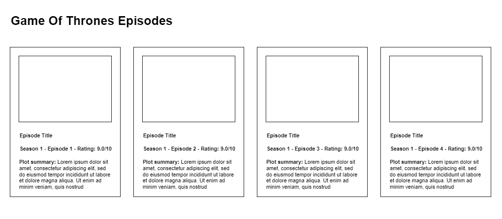

## Web Development OMDb Task

We at CredoWeb are massive fans of the epic Game of Throne series. Your task (should you choose to accept it) is to consume the public [OMDb API](http://www.omdbapi.com/) and display all the seasons and all episodes (with the poster of each episode) of the show according to this basic wireframe:

> 

We'd like to point out this is not the actual design just a wireframe to illustrate the basic view we aim.

Some help for the OMDb API:

* Here you can [request](http://www.omdbapi.com/apikey.aspx) a free API key to the OMDb
* It uses IMDb IDs - the Game Of Throne id is `tt0944947`
* Although not listed in the example but in the changes below appending `&season=X` or `&season=X&episode=Y` gives you the information for the season or episode required

.. and just a few pointers below for the task:

* The development should be done using the [Angular Framework](https://angular.io/)
* Should function as a [Single Page App](http://en.wikipedia.org/wiki/Single-page_application).
* You must use HTML and CSS (using Bootstrap and pre-compilers such as Sass or LESS is fine).
* The star icon (enabled/disabled) is used to save the current episode to the local storage

If you feel like you want to show us what you're are really capable of, here is a list of potential enhancements that we have come up with. You can always go the extra mile and do not limit yourself to it if you think of any other possible feature enhancement that you want to include in your submission. 

* Improve the speed of the page in terms of the images/content loading.
* Infinite scrolling (loading in more episodes as you scroll).
* A search functionality based on episode name.
